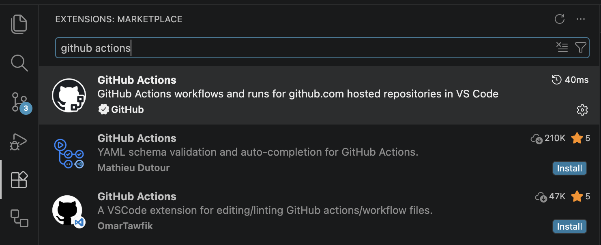

# Learning Resources
- https://docs.github.com/en/actions/reference/workflows-and-actions/workflow-syntax

# How to setup Github Actions Extension
Download Github Actions extension for documentation 

[GHActionsExtension](../../screenshots/GHActionsExtension.png)



# Java analogy for Github Actions
How first-example.yml look like in Java

```java
public class Config {
    // Name (Key to Scalar)
    public String name = "My First Workflow";
    // On (Key to Scalar)
    public String on = "push";
    // Jobs (Key to Key)
    public Jobs jobs;
}

public class Jobs {
    // jobs.<job_id> (Key to Key)
    public FirstJob first_job;
}

public class FirstJob {
    // jobs.<job_id>.runs-on (Key to Scalar)
    public String runs-on = "ubuntu-latest";
    // Jobs (Key to Sequences)
    public Steps[] steps; 
}

public class Steps {
    // Name (Key to Scalar)
    public String name;
    // Run (Key to Scalar)
    public String run;
    
    public Steps(String name, String run) {
        this.name = name;
        this.run = run;
    }
}

// ... For Steps Objects
// Combining them into an array
Steps[] steps = {
    new Steps("Welcome message", "echo 'My first Github Actions'"),
    new Steps("List files", "ls"),
    new Steps("Read file", "cat README.md")
};

```