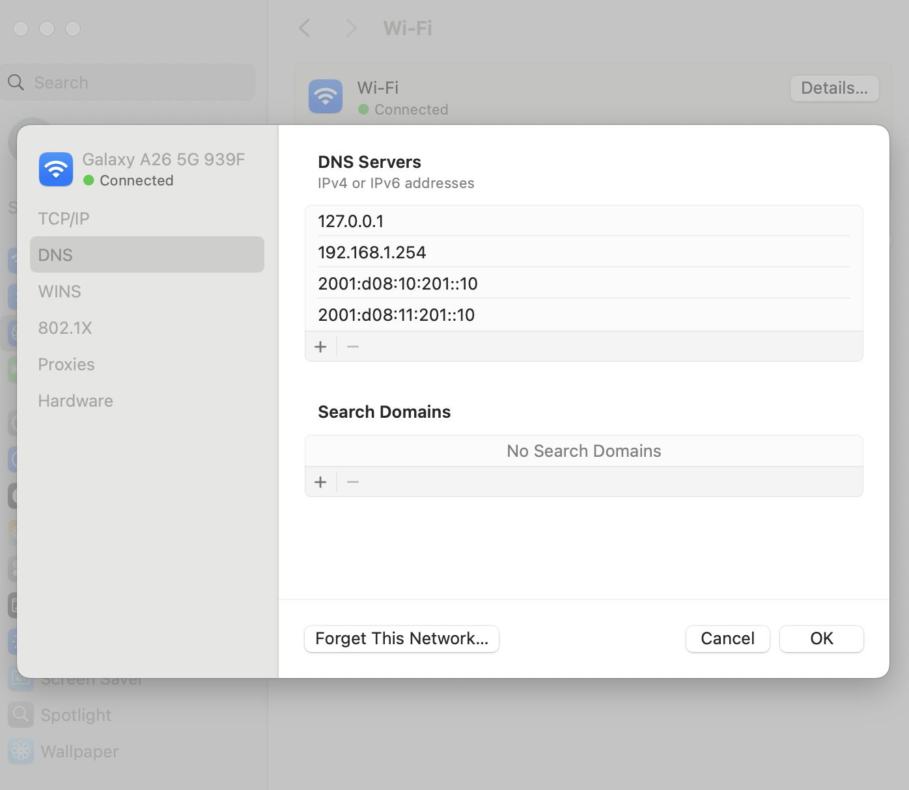

# 2 Tier Setup
Docker build command:
- docker build --tag 2tier:latest .

Docker run command:
- docker run --detach \
        --name=2tier \
        --privileged \
        --restart=always \
        --publish 127.0.0.1:80:80/tcp \
        --publish 127.0.0.1:3306:3306/tcp \
        2tier:latest bash -c "tail -f /dev/null"

I have to run the below commands after Docker run to work:
- docker exec -it 2tier bash
- bash start.sh
- ss -tulpn

# DNS setup
*** The port mapping I follow internetsystemsconsortium/bind9 ***

docker run --detach \
        --name=dns \
        --restart=always \
        --publish 53:53/udp \
        --publish 53:53/tcp \
        --publish 127.0.0.1:953:953/tcp \
        --volume /etc/bind \
        --volume /var/cache/bind \
        --volume /var/lib/bind \
        --volume /var/log \
        ubuntu/bind9

[Configure Client DNS](../screenshots/ConfigureClientDNS.png)

- Take note of previous IPv4 & IPv6 addresses like 192.168.1.254, etc
- Add 127.0.0.1 for localhost because of docker Bind9 DNS

# Test Connection & note down IPv4 Address
- docker exec -it dns sh
- ip a
- exit

ip a output:
172.17.0.3/16

- docker exec -it 2tier sh
- ip a
- exit

ip a output:
172.17.0.2/16 

*** Make appropriate changes to the dns configuration files ***

# Node01 (Bind9 DNS Master)
## Copy over zone file
docker cp \
    ./dns/node01/db.company \
    dns:/etc/bind/db.company

## Configure BIND to use our new zone file
docker cp \
    ./dns/node01/named.conf.local \
    dns:/etc/bind/named.conf.local

## Configure BIND options
docker cp \
    ./dns/node01/named.conf.options \
    dns:/etc/bind/named.conf.options

## Restart DNS servers
docker restart dns

# QNA
Question: How do I configure my computer to connect to container dns? At the same time also connect to the internet?

Answer: MacOS has the GUI, but I think Linux admistration will be different

Question: Should I do a port mapping for the bind9 DNS container? Then configure my local computer to point a localhost DNS server?

Answer: Yes, after setup bind9 DNS container, make local computer point to itself which is 127.0.0.1

- docker build --tag 2tier:latest .

^

The issue you're hitting is a classic Docker "gotcha": Each RUN command in a Dockerfile executes in a completely new, temporary container.

When you ran RUN service mariadb start in Step 5, it started the database, but as soon as that step finished, the temporary container was shut down. By the time you reached Step 7, MariaDB was no longer running, which is why you got the "Can't connect to local server" error.

Question: How to fix ERROR: permission denied while trying to connect to the docker API at unix:///var/run/docker.sock
Answer:
Link to documentation:
https://docs.docker.com/engine/install/linux-postinstall/

1. Create the docker group.
sudo groupadd docker
^
groupadd: group 'docker' already exists

2. Add your user to the docker group.
sudo usermod -aG docker $USER

If you're running Linux in a virtual machine, it may be necessary to restart the virtual machine for changes to take effect.

3. Run the following command to activate the changes to groups:
newgrp docker

4. Verify that you can run docker commands without sudo:
docker run hello-world

5. (Optional) If got permission errors:
sudo chown "$USER":"$USER" /home/"$USER"/.docker -R
sudo chmod g+rwx "$HOME/.docker" -R

- (Not working) Another issue related to DNS:
Answer: Gemini
echo '{"dns": ["8.8.8.8", "1.1.1.1"]}' | sudo tee /etc/docker/daemon.json

sudo systemctl restart docker
sudo systemctl status docker

- (This is the Fix) Another issue related to DNS:
Answer: Gemini
sudo sh -c 'printf "nameserver 8.8.8.8\nnameserver 1.1.1.1\n" > /etc/resolv.conf'
docker run hello-world
^
I think this can be resolve with vagrantfile

Question: Why was my curl http://localhost:80 out my VM stuck? 
Answer: Gemini

docker stop 2tier
docker rm 2tier
docker run --detach \
    --name=2tier \
    --privileged \
    --restart=always \
    --publish 0.0.0.0:80:80/tcp \
    --publish 0.0.0.0:3306:3306/tcp \
    2tier:latest bash -c "tail -f /dev/null"

Question: What is the difference between 127.0.0.1 and 0.0.0.0?

Question: How do I modify docker run command for DNS to work?

docker run --detach \
        --name=dns \
        --restart=always \
        --publish 0.0.0.0:53:53/udp \
        --publish 0.0.0.0:53:53/tcp \
        --publish 0.0.0.0:953:953/tcp \
        --volume /etc/bind \
        --volume /var/cache/bind \
        --volume /var/lib/bind \
        --volume /var/log \
        ubuntu/bind9

Question: How do I fix DNS issue in VM?
sudo sh -c 'printf "nameserver 127.0.0.1" > /etc/resolv.conf'
cat /etc/resolv.conf

Question: 
There several layers of networking:
Host 
^
I had to clear DNS cache recommended by Gemeni:
sudo dscacheutil -flushcache; sudo killall -HUP mDNSResponder
dig uat.company

VM
^
I had to run the below command for docker to run build command successfuly:
sudo sh -c 'printf "nameserver 8.8.8.8\nnameserver 1.1.1.1\n" > /etc/resolv.conf'

Docker
^
I had to run Bind9 DNS container on host level instead of VM level for my app to work