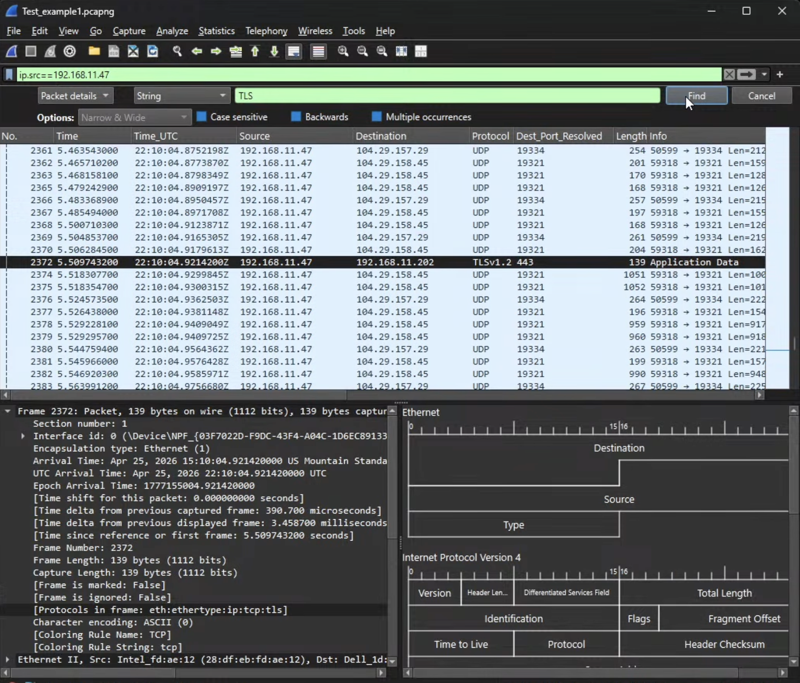
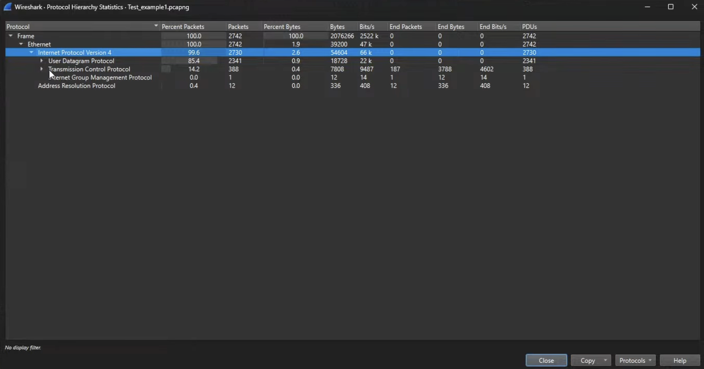
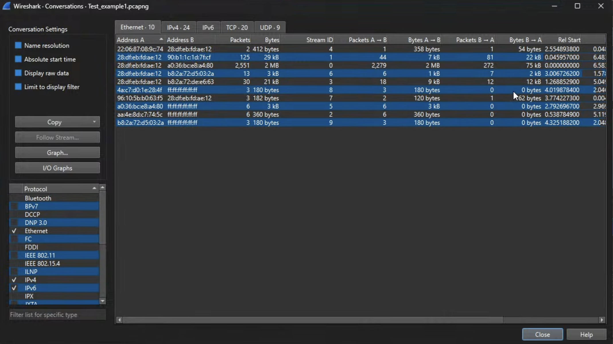

# Resources to learn from
Youtube video on the study guide
https://www.youtube.com/watch?v=Jl_rCpLIWa0&t=709s

Het Tanis Wireshark_WCA_101_Study_Guide.pdf as well

Link to header asci art:
https://datatracker.ietf.org/doc/html/rfc791#section-3.1

Even though Wireshark is more of a network engineer tool, you can use it as an
alternative to tcpdump, so instead of tcpdump, you use pcap format.

Het Tanis use Wireshark to filter out why data is not flowing
into host on network, so like see source & destination.

There's a difference between a filter & find in Wireshark
- Find will actually go through your packets without actually limitting them down
- Filter will only show you the packets you want to see

[Find](./screenshots/ControlPlusF.png)

If you want to see how healthy the system is, go to:
Statistics -> Protocol Hierarchy 

[Protocol Hierarchy Statistics](./screenshots/ProtocolHiearchyStatistics.png)

Conversations shows you what nodes are talking to what nodes, go to:
Statistics -> Conversations

[Conversations Statistics](./screenshots/ConversationsStatistics.png)

Another similar one to above, go to: 
Statistics -> End Point

# 1.0 Utilize key features of Wireshark (10%)
pcapng has more meta data to the field

# 2.0 Utilize different methods of Capturing Traffic (10%)

# 3.0 Filter traffic using capture and display filters. (12%)

# 4.0 Configure, adapt, and use the Wireshark interface for different scenarios. (5%)

# 5.0 Identify and explain common network protocols dissected by Wireshark. (43%)
(note: TCP is 17% of exam and is scored separately. Non-TCP protocols are 27% of exam)

# 6.0 Use Wireshark to troubleshoot common issues with protocols listed above. (20%)