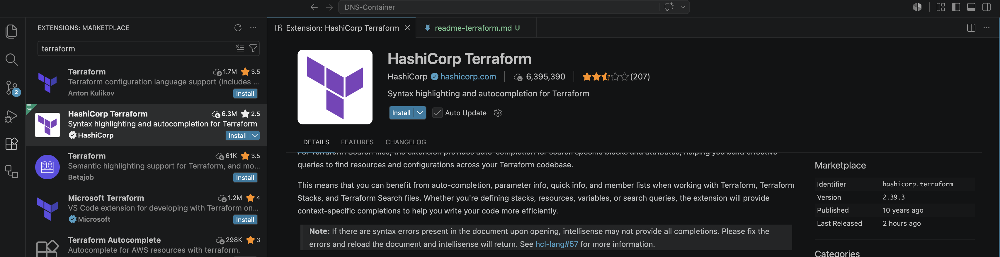
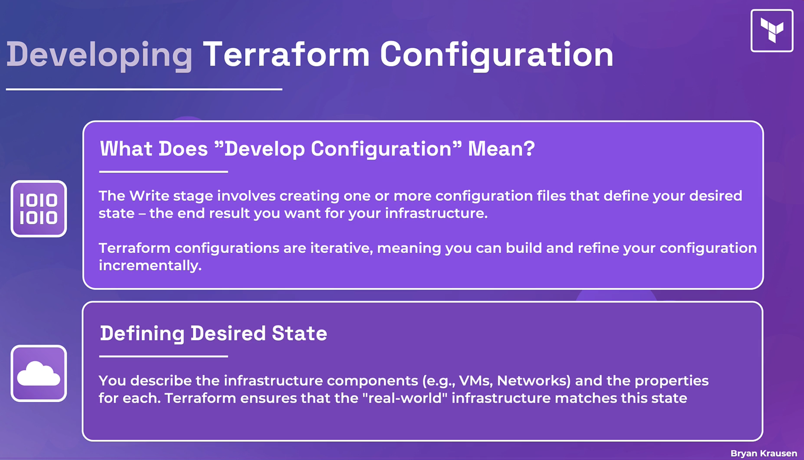
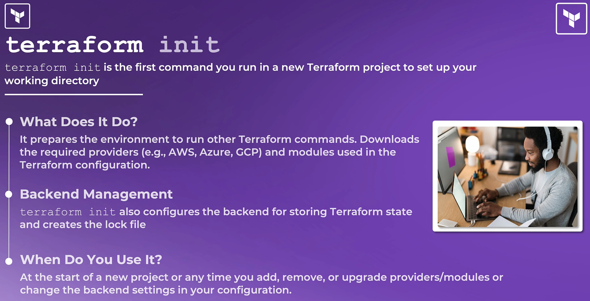
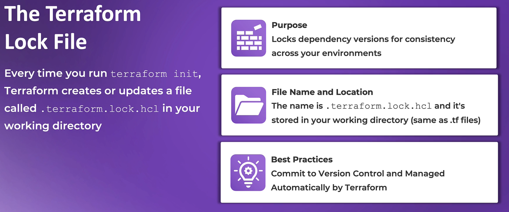
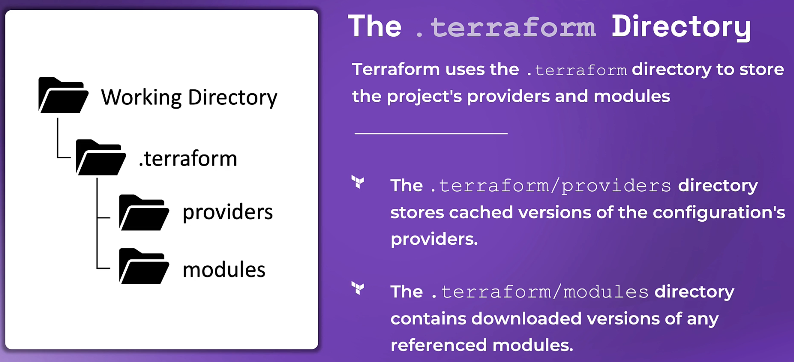
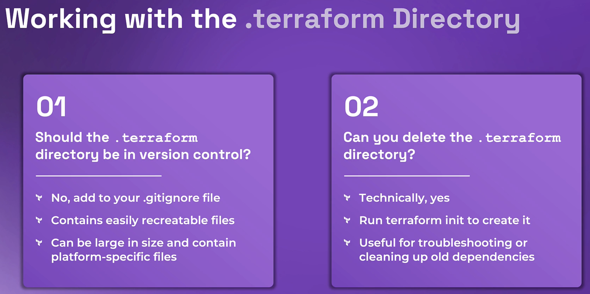

# Terraform Extensions to Install

[Terraform Extension](./screenshots/TerraformExtension.png)

# Resources to learn
*** Terraform can actually spin up vms through Proxmox ***
*** Terraform can be used in local testing using AWS emulators like localstack, ministack, floci ***

List of available local AWS emulators:
- https://github.com/ministackorg/ministack
- https://github.com/floci-io/floci
- https://github.com/localstack/localstack

LocalStack Explained: Simulate AWS Services for Seamless Development:
https://www.youtube.com/watch?v=_PD4j5Ra3kY

Run 45 AWS Services Locally FREE: Floci, Quarkus and GraalVM-Powered, LocalStack Alternative (#96):
https://www.youtube.com/watch?v=dvyDakgeMig

# single-line comment
block_type "block_label" "block_label" {
    first_argument  = expression or value
    second_argument = expression or value
    third_argument  = expression or value
}

# main.tf
# Retrieve the list of AZs in the current AWS region
# data blocks
data "aws_availability_zones" "available"
data "aws_region" "current" {}

# Define the VPC
# resource block
resource "aws_vpc" "vpc" {
  cidr_block = var.vpc_cidr

  # arguments
  tags = {
    Name        = var.vpc_name
    Environment = "demo_environment"
    Terraform   = "true"
  }
}

# Block Example breakdown
# Type of block
resource 

# Resource Type
"aws_vpc"

# Name (Need to be unique name)
"vpc"

# Core Components
## Terraform Core
CLI tool that provisions and manages infrastructure resources as
defined in Terrafrom configuration files

## Providers
Extends the functionality of Terraform for specific platforms, such as
public cloud providers, SaaS offerings, etc.

## Resources
Infrastructure components or services that are managed by Terraform
(virtual machines, networks, DNS records, etc)

## State
How Terraform maps the desired configuration with real-world
resources on the target platform

## Modules
Reusable and sharable blocks of code that can be called over and over again

## Intro to the Terraform Workflow

[Slide](./screenshots/DevelopingTFConfiguration.png)

## Terraform Init

[Slide](./screenshots/TerraformInit.png)

[Slide 2](./screenshots/TerraformLockFile.png)

[Slide 3](./screenshots/TerraformDirectory.png)

[Slide 4](./screenshots/TerraformDirectory.png)

[Slide 5](./screenshots/WorkingWithTerraformDirectory.png)

1) Should the .terraform directory be in version control?
- No, add to your .gitignore file
- Contains easily recreatable files
- Can be large in size and contain platform-specific files

2) Can you delete the .terraform directory?
- Technically,yes
- Run terraform init to create it
- Useful for troubleshooting or cleaning up old dependencies

# Terraform Plan