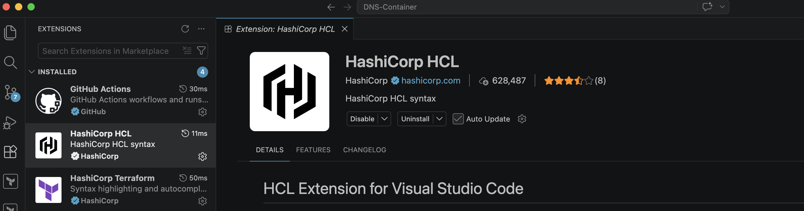
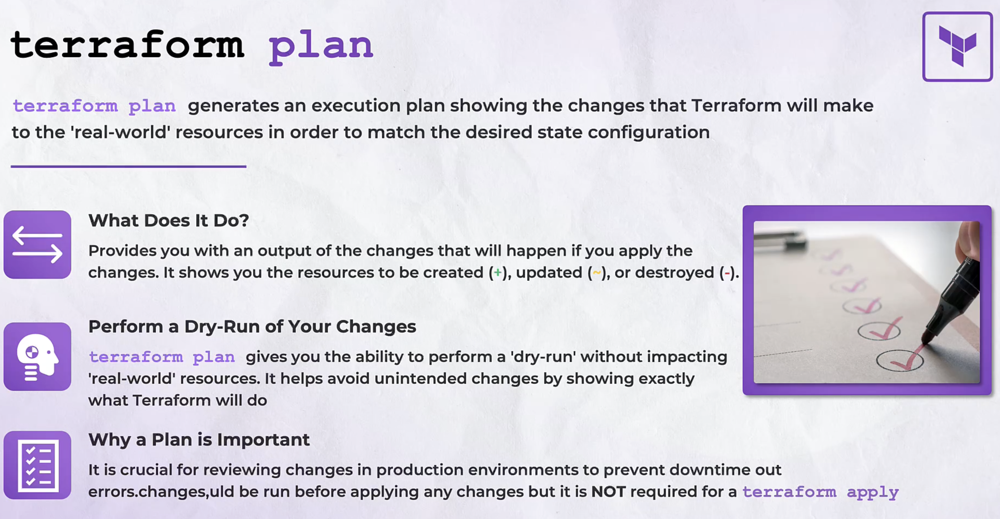
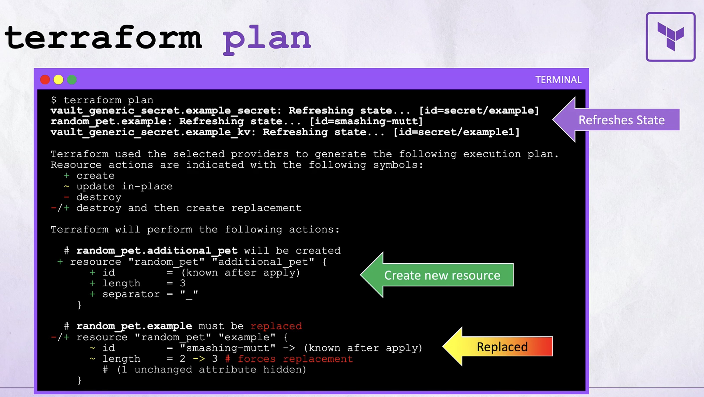
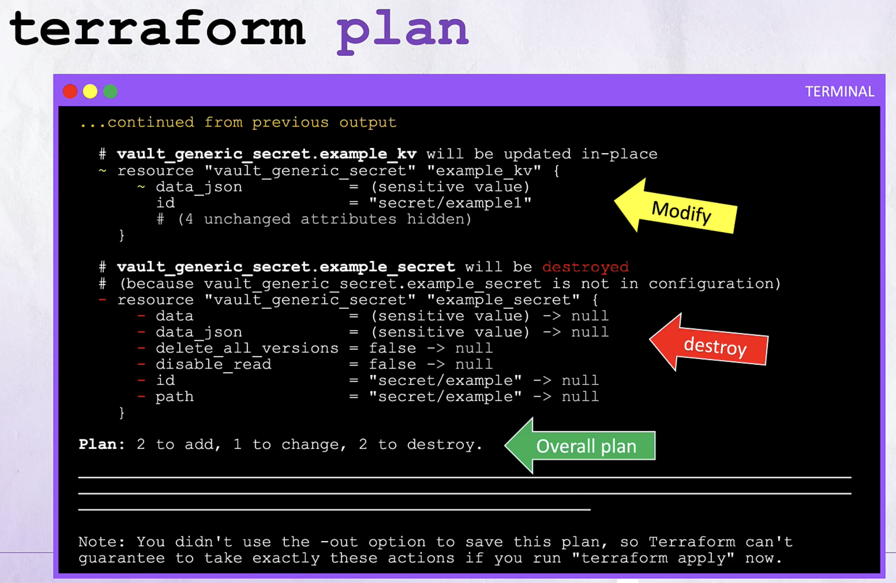
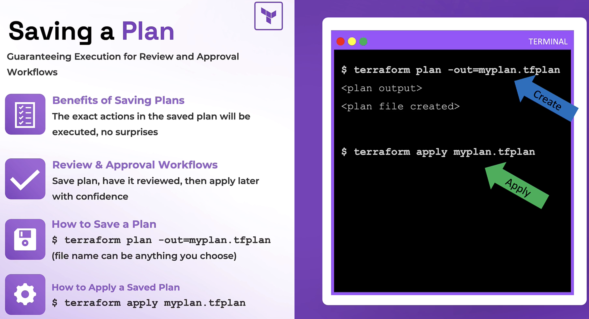

# Resources to learn
- https://notes.kodekloud.com/docs/HashiCorp-Certified-Terraform-Associate-004/Course-Introduction/Course-Introduction/page

# Terraform Extensions to Install

[Terraform Extension](./screenshots/TerraformExtension.png)


[HCL Extension](./screenshots/HCLExtension.png)



# Resources to learn
*** Terraform can actually spin up vms through Proxmox ***

*** Terraform can be used in local testing using AWS emulators like localstack, ministack, floci ***

List of available local AWS emulators:
- https://github.com/ministackorg/ministack
- https://github.com/floci-io/floci
- https://github.com/localstack/localstack

LocalStack Explained: Simulate AWS Services for Seamless Development:
- https://www.youtube.com/watch?v=_PD4j5Ra3kY

Run 45 AWS Services Locally FREE: Floci, Quarkus and GraalVM-Powered, LocalStack Alternative (#96):
- https://www.youtube.com/watch?v=dvyDakgeMig

# Terraform Foundations
## Section Introduction Terraform Foundations

### What is Terraform?
Key verbs you’ll use frequently:
- terraform init — initialize a working directory
- terraform plan — preview changes before applying
- terraform apply — execute the planned changes
- terraform destroy — remove managed infrastructure

### (Skip) Why organizations use Terraform

### Core Terraform concepts
|Concept           |Purpose                               |Example/Notes |
| --- | --- | --- |
|Configuration     |Declare resources and settings        |Files with .tf using HCL (HashiCorp Configuration Language) |
|Provider          |Plugin for a target platform          |provider "aws" { region = "us-east-1" } |
|Resource          |A managed infrastructure object       |resource "aws_instance" "web" { ... } |
|State             |Maps config to real resources         |Stored locally or remotely (S3, Terraform Cloud) |
|Plan/Apply        |Preview and enact changes             |terraform plan → terraform apply |
|Module            |Reusable configuration unit           |Local or registry-based modules for reuse |

Terraform state contains the authoritative mapping of resources. Protect and manage state carefully (use remote backends and locking for teams) to avoid resource drift and corruption.

### How Terraform improves workflows
- Automation and CI/CD: Integrate Terraform into pipelines to provision and update infrastructure automatically.

- Collaboration: Use remote state backends and workspaces to coordinate changes among teams.

- Drift detection: terraform plan surfaces differences between configuration and real infrastructure.

- Idempotence: Reapplying the same configuration converges the environment to the declared state.
​
### Common usage pattern
1. Write configuration (*.tf files).
2. Initialize the working directory:
- terraform init

3. Validate and preview changes:
- terraform validate
- terraform plan

4. Apply changes:
- terraform apply

5. Maintain and update through version control and CI.

## (Skip) Introduction to Terraform

## Learn the Basics of HashiCorp Configuration Language HCL
HCL is declarative: you describe the desired end state (for example, “a VPC with CIDR 10.0.0.0/16”) and Terraform determines how to create or update resources to match that state. Think of it like ordering a dish at a restaurant — you specify the final result, not every step required to cook it.

### HCL structure and basic syntax
HCL configurations are organized into blocks that group related configuration items. Each block has:
- A block type (for example, resource, data, variable, output)
- One or more labels (for example, a resource type and an instance name)
- A body containing arguments and optionally nested blocks

Comments are supported and useful for documenting intent:
- Single-line comments: # or //
- Multi-line (block) comments: /* ... */

Example annotated HCL:
// single-line comment
block_type "block_label" "block_label" {
  first_argument  = expression_or_value
  second_argument = expression_or_value
  third           = expression_or_value
}

// Top-level assignments must appear inside appropriate blocks (for example, locals).
locals {
  attribute_abc = "value_1"
  attribute_2   = "value_2"
}

Files use the .tf extension (for example, main.tf). Terraform automatically loads .tf files in a directory as a single configuration.

### Common HCL block types (at-a-glance)
Block Type      Purpose                                                 Example
resource        Declares infrastructure to create and manage            resource "aws_instance" "web" { ... }
data            Reads information from existing infrastructure          data "aws_ami" "ubuntu" { ... }
variable        Declares input values for a module                      variable "aws_region" { type = string }
output          Exposes values from a module or root configuration      output "vpc_id" { value = aws_vpc.vpc.id }
locals          Defines local computed values                           locals { common_tags = { Environment = "dev" } }

### A real example: defining a VPC
Below is a compact, realistic Terraform configuration showing data sources and a resource block that defines an AWS VPC:

// Retrieve the list of availability zones in the current AWS region
data "aws_availability_zones" "available" {}

// Retrieve the current AWS region
data "aws_region" "current" {}

// Define the VPC
resource "aws_vpc" "vpc" {
  cidr_block = var.vpc_cidr

  tags = {
    Name        = var.vpc_name
    Environment = "demo_environment"
    Terraform   = "true"
  }
}

Key points:
- data blocks read existing information (e.g., AZs or AMIs).
- resource blocks declare resources Terraform will manage.
- Arguments inside resource blocks (like cidr_block) describe desired properties, not procedural steps.

Use terraform fmt or a Terraform-aware editor (for example, the VS Code Terraform extension) to keep formatting consistent automatically.

### Anatomy of a resource block
*** First label aws_vpc is tied to the provider ***

Question: How do I reference the correct resource from provider? Do I have to read the documentation?

Breakdown of the VPC resource block:
- resource — keyword indicating managed infrastructure.
- First label ("aws_vpc") — the resource type provided by the provider (AWS in this case).
- Second label ("vpc") — the local instance name that uniquely identifies this resource in the module.
- Body — arguments (like cidr_block) and nested blocks (like tags) describing the resource.

Reference a resource elsewhere using the canonical address resource_type.resource_name, for example aws_vpc.vpc. That address allows other resources, modules, and outputs to read attributes from the VPC.

Each resource name (the second label) must be unique per resource type within a module. For multiple VPCs use distinct names, for example:

resource "aws_vpc" "production" { ... }
resource "aws_vpc" "test"       { ... }

### (Copy Paste) HCL style recommendations

### (Copy Paste) Quick workflow (getting started)

### (Skip) Summary

## Lets Look at Resource Referencing with Demo
*** You can manage github repositories with terraform ***

*** I skip explanation on referencing because there was no example code ***

HCL demo: writing Terraform files in VS Code

This demo shows practical HCL examples and recommended workflow items (like using terraform fmt). The focus is on writing, referencing, and formatting HCL rather than provider-specific behavior.

1. Create a file named github.tf in your working directory. VS Code with a Terraform extension will provide syntax highlighting and snippets for provider and resource blocks.

2. Add a provider block that references a token variable:
```terraform
provider "github" {
  token = var.github_token
}
```

3. Define a repository resource. Each resource block is a combination of type and local name that forms the unique address used elsewhere in the configuration:
```terraform
resource "github_repository" "production-repo" {
  name        = "prod-repo"
  description = "Repo for our production app"
  private     = true
}
```

4. Add another repository using a different local name so both resources have unique addresses:
```terraform
resource "github_repository" "testing-repo" {
  name        = "test-repo"
  description = "Repo for our testing app"
  private     = true
}
```

Every resource instance in a Terraform configuration must have a unique address: the combination of its type and its local name (for example, github_repository.production-repo). Reusing the same local name for two instances of the same resource type will produce a configuration error.

Do not hard-code sensitive values (like provider tokens) directly in .tf files. Use input variables, terraform.tfvars, or environment variables (for example, TF_VAR_github_token) and store secrets in a secure secrets manager or CI/CD secret store.

Using terraform fmt to format HCL

Keep code readable and consistent with terraform fmt. It normalizes indentation and aligns assignment operators to Terraform’s canonical style.

Examples:
- Run the formatter across the working directory:
```bash
$ terraform fmt
github.tf
test.tf
```

- If only one file required formatting, the output might be:
```bash
$ terraform fmt
github.tf
```

Splitting resources across files

Terraform treats all .tf files in a directory as a single configuration. Use multiple files to organize resources logically — e.g., separate providers, networking, compute, and test resources.

Example file split:

test.tf:
```terraform
resource "github_repository" "testing-repo" {
  name        = "test-repo"
  description = "Repo for our testing app"
  private     = true
}
```
github.tf:
```terraform
provider "github" {
  token = var.github_token
}

resource "github_repository" "production-repo" {
  name        = "prod-repo"
  description = "Repo for our production app"
  private     = true
}
```
Running terraform fmt in the directory will scan and format all .tf files and report each file it modified.

Quick best practices

Area	              Recommendation
- Referencing	      Prefer using attributes from created resource or data blocks instead of hard-coded values
- Secrets	Use       variables and secure secret stores — avoid committing tokens to VCS
- Formatting	      Run terraform fmt regularly or enable automatic formatting in your editor
- Organization	    Group related resources into separate .tf files or modules for maintainability

Wrap-up
- Resource referencing enables dynamic, maintainable Terraform configurations by passing values between blocks rather than hard-coding.
- Terraform uses references to build a dependency graph and determine the correct provisioning order.
- Maintain consistent style with terraform fmt, split files for clarity, and keep secrets out of source files.

## (Continue) Learn about Best Practices for HCL

## Core Components and Benefits of Terraform

### Summary Table
|Component           |Role                               |Example |
| --- | --- | --- |
|Terraform Core | Execution engine; builds dependency graph and applies changes | CLI commands: terraform init, terraform plan, terraform apply|
|Provider | Translates resources to API calls for a platform | provider "aws" { region = "us-east-1" }|
|Resource | Declares infrastructure objects to manage | resource "aws_instance" "web" { ... }|
|State | Persists mapping and metadata of managed resources | backend "s3" { ... }|
|Module | Reusable configuration package | module "vpc" { source = ".../vpc" }|

### Terraform Core
Terraform Core is the CLI binary that reads and interprets your Terraform configuration files (.tf). When you run terraform init, terraform plan, or terraform apply, you are interacting with Terraform Core. Its responsibilities include:

- Parsing configuration files and building a dependency graph.
- Comparing your declared configuration against the current state.
- Determining a plan of changes and orchestrating provider API calls to create, update, or destroy resources.

Terraform Core is provider-agnostic: it defines the workflow and execution model while delegating resource-specific operations to providers.

### Providers
Providers are plugins that extend Terraform Core with the logic to manage resources on a particular platform (AWS, Azure, Google Cloud, GitHub, etc.). Providers implement the mappings between Terraform resource declarations and platform API calls.

A minimal provider block:
```terraform
provider "aws" {
  region = "us-east-1"
}
```

Notes about providers:
- Version pin providers to ensure reproducible behavior.
- Providers may require credentials and specific configuration (environment variables, shared configs, or explicit blocks).
- Provider plugins are installed during terraform init.

### Resources
Resources are the primary declarations that describe the infrastructure objects Terraform will manage — compute instances, networks, databases, DNS records, and more. Each resource block contains arguments (inputs) and exposes attributes (outputs) that can be referenced elsewhere.

Example resource:
```terraform
resource "aws_instance" "web" {
  ami           = "ami-0c55b159cbfafe1f0"
  instance_type = "t3.micro"

  tags = {
    Name = "example-web"
  }
}
```

Key resource concepts:
- Attributes such as IDs and computed values are stored in state and can be referenced using interpolation.
- Lifecycle meta-arguments (create_before_destroy, prevent_destroy) control how Terraform updates resources.
- Resource dependencies are inferred from references; explicit depends_on can enforce ordering when needed.

### State
Terraform state is the authoritative record of what Terraform manages in the real world. It maps resources in your configuration to real-world objects, stores metadata (IDs, attributes), and enables Terraform to compute incremental diffs.

State enables:
- Mapping real resources to configuration.
- Accurate planning and targeted updates.
- Sensitive metadata persistence (resource IDs, ARNs, endpoints).

Remote state and locking are critical for team workflows. Example S3 backend with DynamoDB locking:
```terraform
terraform {
  backend "s3" {
    bucket         = "my-terraform-state-bucket"
    key            = "project-name/terraform.tfstate"
    region         = "us-east-1"
    dynamodb_table = "terraform-lock-table"
  }
}
```

Remote state backends enable team collaboration, state locking, and recovery. Use them for shared environments to avoid state conflicts and accidental overwrites.

Terraform state can contain sensitive information (secrets, IDs, endpoints). Use encrypted storage, restrict access, and avoid committing state files to source control.

### Modules
Modules are reusable, composable packages of Terraform configuration — the primary method to encapsulate and share common infrastructure patterns. Think of modules as functions or libraries for infrastructure.

Calling a module:
```terraform
module "vpc" {
  source = "git::https://example.com/terraform-modules.git//vpc"
  cidr   = "10.0.0.0/16"
  region = "us-east-1"
}
```

Module best practices:
- Keep modules focused and opinionated.
- Expose inputs (variables) and outputs (outputs) for composability.
- Version and publish modules (Terraform Registry, Git tags) for stability.

### Component Overview
- Terraform Core: Orchestrates the execution model and dependency graph.
- Providers: Implement API interactions for specific platforms.
- Resources: Declare the desired infrastructure objects.
- State: Records the current status and metadata of managed resources.
- Modules: Package reusable configuration patterns.


# Terraform Configuration - Fundamentals
## (Continue) Connecting to Cloud Platforms with Provider Blocks

Question: Where does Kubernetes fit in cloud?

## (Continue) Creating Infrastructure with Resource Blocks
*** You need to consult Terraform registry for available resource types and argument details ***
*** I wonder if there's a way for me to read the Terraform registry with VScode ***

### Resource: aws_instance
https://registry.terraform.io/providers/hashicorp/aws/latest/docs/resources/instance

### Argument Reference
https://registry.terraform.io/providers/hashicorp/aws/latest/docs/resources/instance#argument-reference

Example: two EC2 instances:

resource "aws_instance" "web" {
  ami           = "ami-012345"
  instance_type = "t2.micro"

  key_name  = "prd-web-key"
  subnet_id = "subnet-12345abc"

  tags = {
    Name = "prd-web-svr-01"
  }
}

resource "aws_instance" "db" {
  ami           = "ami-0c55b159"
  instance_type = "m5.4xlarge"
}

Example configuration for a production stack:

resource "aws_lb" "public_load_balancer" {
  name               = "prd-web-lb"
  load_balancer_type = "network"
}

resource "fortios_firewall_policy" "allow_web_443" {
  action = "accept"
  name   = "allow_web_443"
}

resource "aws_instance" "web" {
  instance_type = "t3.large"
  ami           = "ami-0c55b159"
}

resource "aws_db_instance" "prd_db" {
  engine         = "mysql"
  instance_class = "db.t3.large"
}

- The aws_lb name value (prd-web-lb) is provider-visible and will appear in the AWS Console.
- Each block maps to a real-world component; together they create a functioning environment.

Example: create a GitHub repository, a branch, and set the default branch:

resource "github_repository" "prod_repo" {
  name       = "prod-app-xyz-repo"
  visibility = "private"
}

resource "github_branch" "default" {
  repository = github_repository.prod_repo.name
  branch     = "main"
}

resource "github_branch_default" "default" {
  repository = github_repository.prod_repo.name
  branch     = github_branch.default.branch
}

# Understading and Managing Terraform State
## (Continue) Remote State Configuration
*** This looks like the real meat of Terraform ***

# Extra
# single-line comment
block_type "block_label" "block_label" {
    first_argument  = expression or value
    second_argument = expression or value
    third_argument  = expression or value
}

# main.tf
# Retrieve the list of AZs in the current AWS region
# data blocks
data "aws_availability_zones" "available"
data "aws_region" "current" {}

# Define the VPC
# resource block
resource "aws_vpc" "vpc" {
  cidr_block = var.vpc_cidr

  # arguments
  tags = {
    Name        = var.vpc_name
    Environment = "demo_environment"
    Terraform   = "true"
  }
}

# Block Example breakdown
# Type of block
resource 

# Resource Type
"aws_vpc"

# Name (Need to be unique name)
"vpc"


# Core Components
## Terraform Core
CLI tool that provisions and manages infrastructure resources as
defined in Terrafrom configuration files

## Providers
Extends the functionality of Terraform for specific platforms, such as
public cloud providers, SaaS offerings, etc.

## Resources
Infrastructure components or services that are managed by Terraform
(virtual machines, networks, DNS records, etc)

## State
How Terraform maps the desired configuration with real-world
resources on the target platform

## Modules
Reusable and sharable blocks of code that can be called over and over again

## Intro to the Terraform Workflow

[Slide](./screenshots/DevelopingTFConfiguration.png)


## Terraform Init

[Slide](./screenshots/TerraformInit.png)


[Slide 2](./screenshots/TerraformLockFile.png)


[Slide 3](./screenshots/TerraformDirectory.png)


[Slide 4](./screenshots/TerraformDirectory.png)


[Slide 5](./screenshots/WorkingWithTerraformDirectory.png)


## Terraform Plan

[Slide](./screenshots/TerraformPlan.png)



[Slide 2](./screenshots/TerraformPlanTwo.png)



[Slide 3](./screenshots/TerraformPlanThree.png)



[Slide 4](./screenshots/TerraformPlanFour.png)




1) Should the .terraform directory be in version control?
- No, add to your .gitignore file
- Contains easily recreatable files
- Can be large in size and contain platform-specific files

2) Can you delete the .terraform directory?
- Technically,yes
- Run terraform init to create it
- Useful for troubleshooting or cleaning up old dependencies

# Terraform Plan